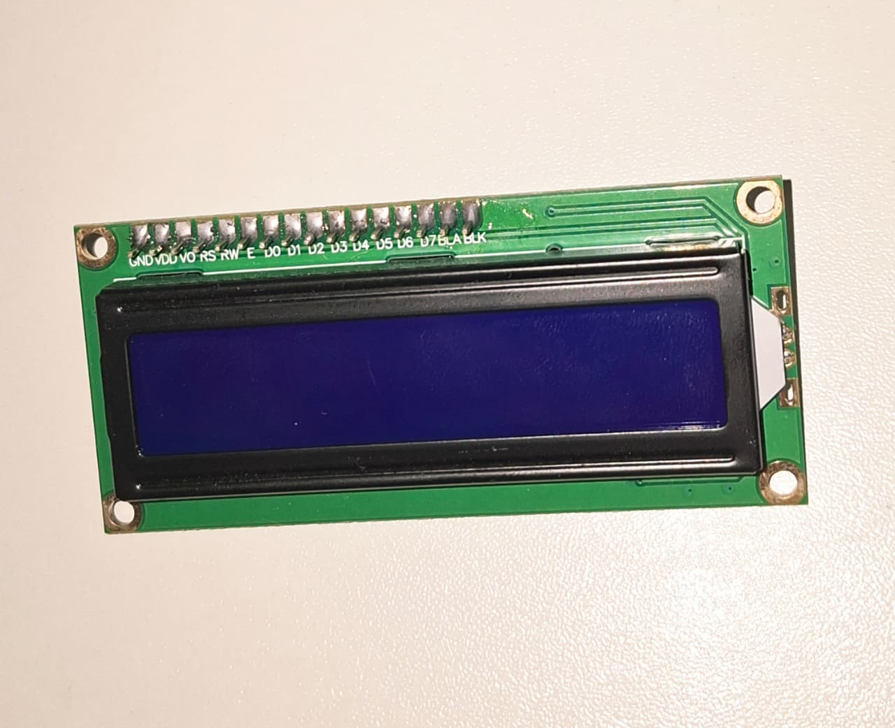
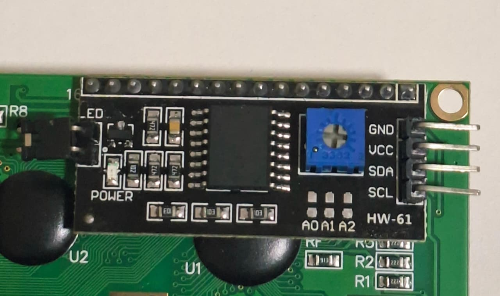
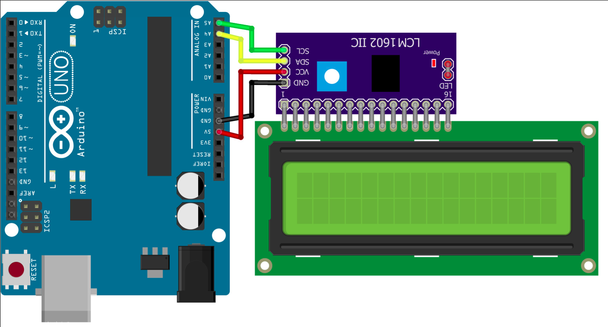

# LCD 16x2 I2C (Circuito do Perfil)

O display **LCD 16x2 com módulo I2C** é um dos componentes mais utilizados em projetos com Arduino para exibir informações de forma simples e eficiente. Neste projeto, o display escreve a mensagem **"Welcome to my"** na primeira linha e **"profile"** na segunda, exibindo cada caractere individualmente para simular um efeito de digitação, e você pode personalizar pra qualquer mensagem no código

---

## Componentes Utilizados

| Quantidade | Componente          |
| ---------- | ------------------- |
| 1          | Arduino Uno         |
| 1          | LCD 16x2            |
| 1          | Módulo I2C (PCF8574)|
| 4          | Jumpers Fêmea - Macho            |
| 1          | Cabo USB A/B        |

---

## Componentes

<table>
<tr align="center">

<td>
<b>Arduino Uno</b> 

</td>

<td>
<b>LCD 16x2</b> 

</td>

<td>
<b>Módulo I2C</b> 

</td>

<td>
<b>Jumpers</b> 

</td>

<td>
<b>Cabo USB A/B</b> 

</td>

</tr>
</table>

---

## Ligações

| Módulo I2C | Arduino Uno |
| ----------- | ----------- |
| VCC         | 5V          |
| GND         | GND         |
| SDA         | A4          |
| SCL         | A5          |

> O módulo I2C reduz a quantidade de conexões necessárias para controlar o LCD, utilizando apenas dois pinos de comunicação (SDA e SCL), além da alimentação.

---

## Esquema do Circuito

---

## Como Funciona

O módulo I2C (Inter-Integrated Circuit) atua como uma interface entre o Arduino e o display LCD.

Enquanto um LCD convencional exige diversos pinos digitais para funcionar, o módulo I2C converte toda a comunicação para apenas duas linhas:

- SDA (Serial Data): responsável pela transmissão dos dados.
- SCL (Serial Clock): responsável pela sincronização da comunicação.

Após inicializar o display, o Arduino posiciona o cursor na primeira linha e escreve a mensagem "Welcome to my" caractere por caractere. Em seguida, o cursor é movido para a segunda linha, onde a palavra "profile" é exibida utilizando o mesmo efeito.

Como toda a animação ocorre na função `setup()`, a mensagem é escrita apenas uma vez quando o Arduino é ligado ou reiniciado.

---

## Demonstração

[Vídeo do funcionamento](circuito/LCD.mp4)

---

## Código Fonte

[Código-fonte](codigo.ino)