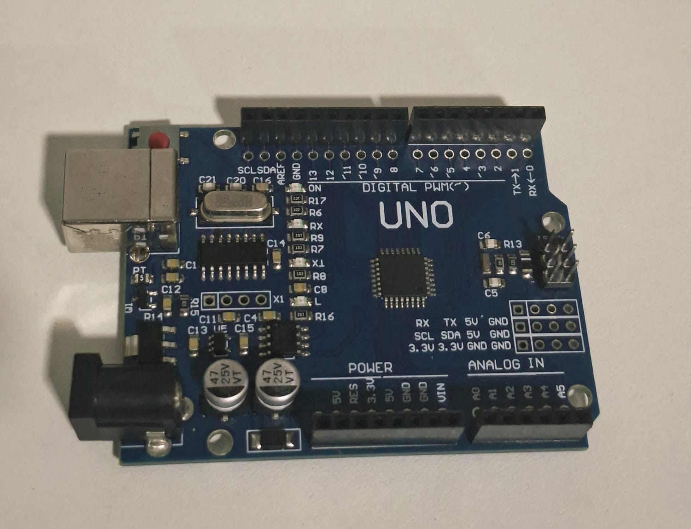
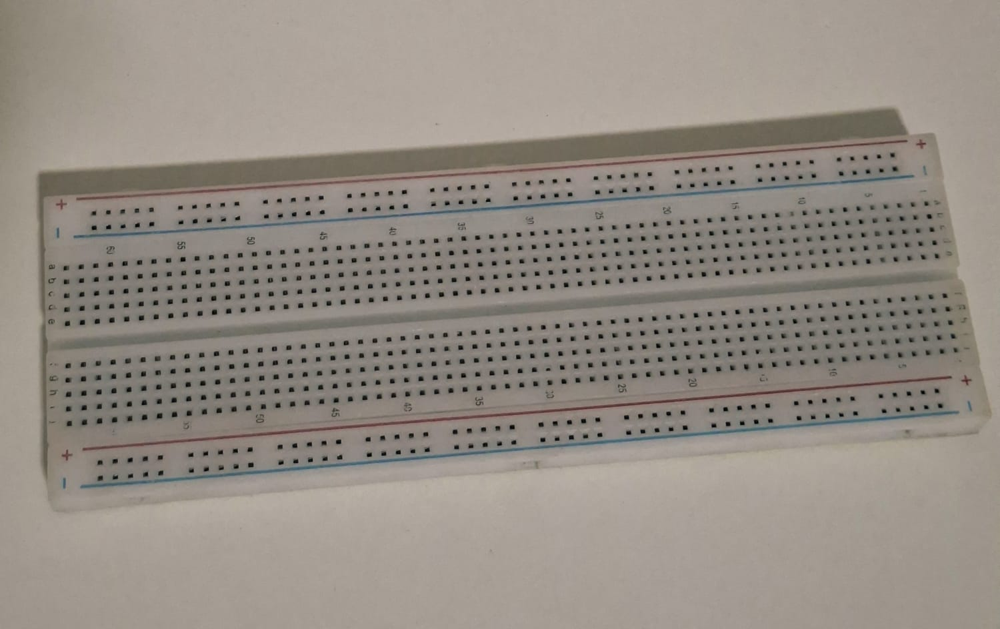
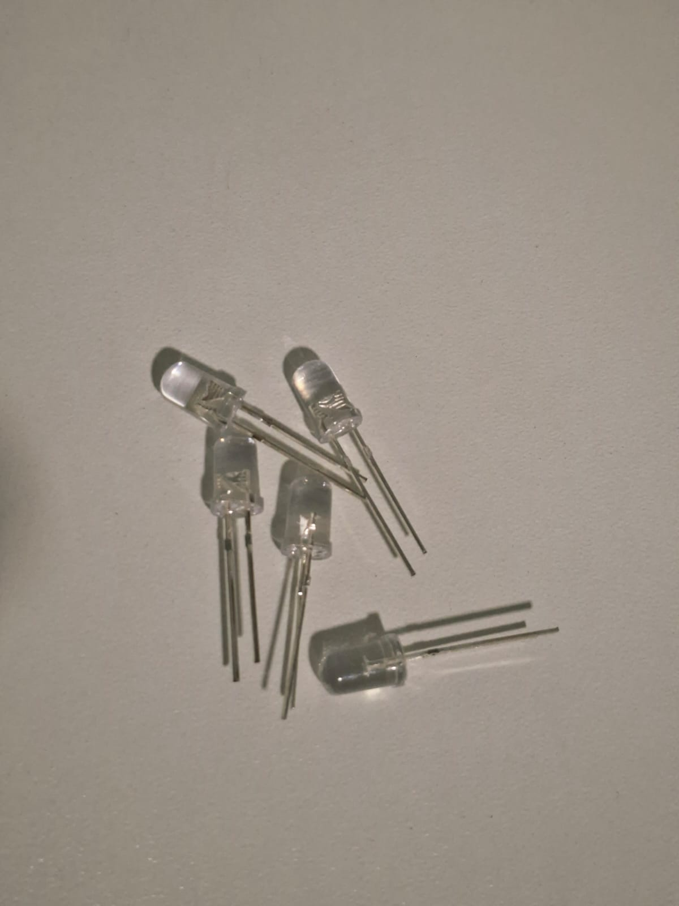
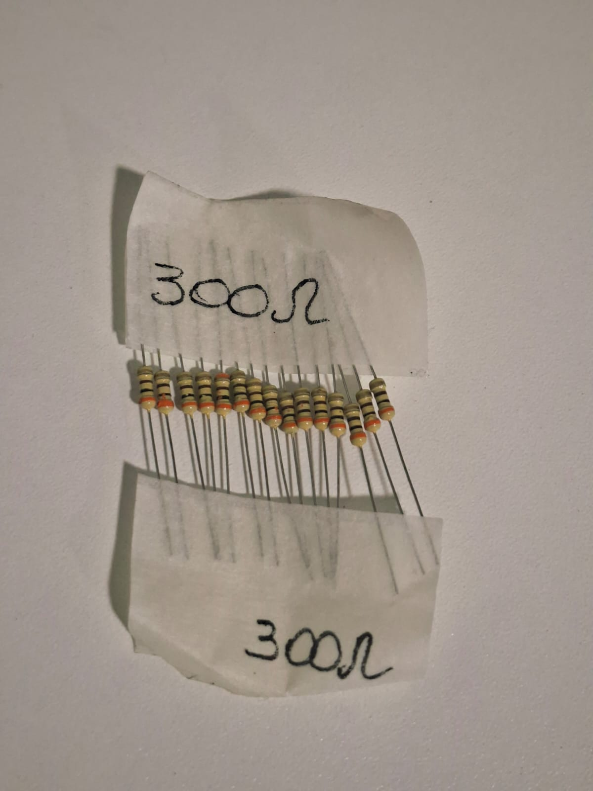
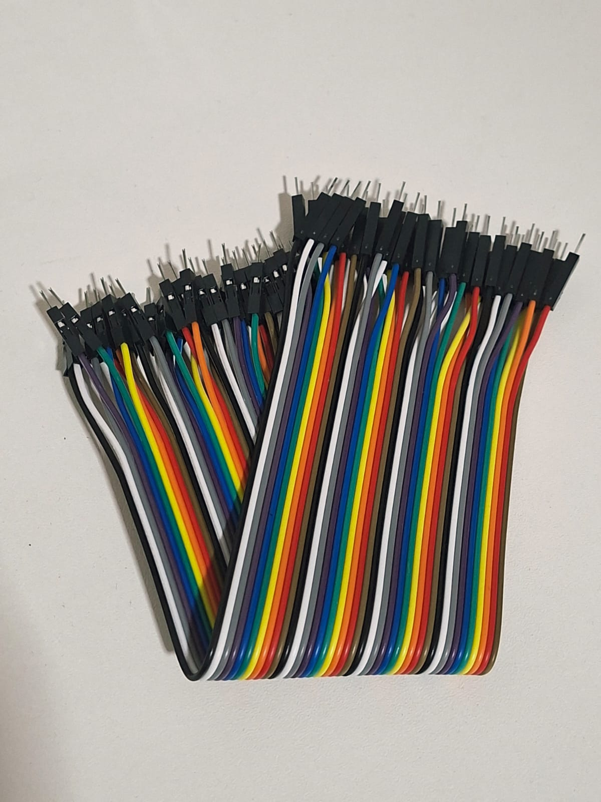
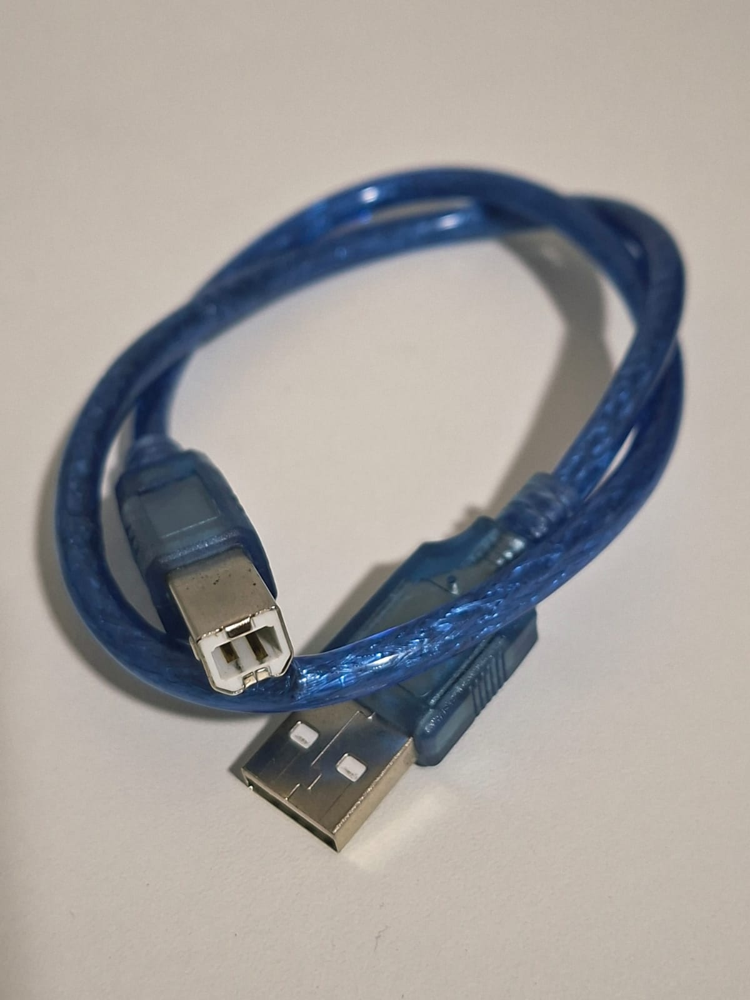
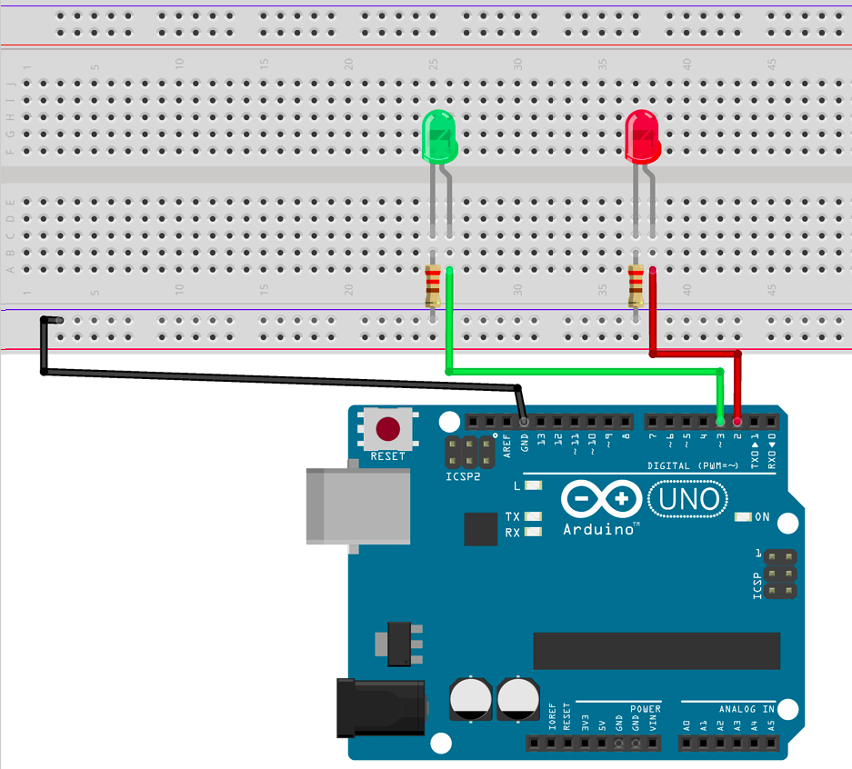

# Hello World

Assim como fazemos ao aprender uma nova linguagem de programação, o **"Hello World"** da robótica consiste em controlar o acionamento de LEDs. Este projeto apresenta os conceitos básicos de programação embarcada, manipulação de saídas digitais e montagem de circuitos utilizando o Arduino Uno.

---

## Componentes Utilizados

| Quantidade | Componente       |
| ---------- | ---------------- |
| 1          | Arduino Uno      |
| 2          | LEDs             |
| 2          | Resistores 300 Ω |
| 3          | Jumpers          |
| 1          | Protoboard       |
| 1          | Cabo USB A/B     |

---

## Componentes

<table>
<tr align="center">
<td>
<b>Arduino Uno</b> 

</td>

<td>
<b>Protoboard</b> 

</td>

<td>
<b>LEDs</b> 

</td>

<td>
<b>Resistores 300 Ω</b> 

</td>

<td>
<b>Jumpers</b> 

</td>

<td>
<b>Cabo USB A/B</b> 

</td>
</tr>
</table>

---

## Ligações

| Componente                 | Arduino              |
| -------------------------- | -------------------- |
| Ânodo (+) do LED vermelho  | Pino Digital 2       |
| Cátodo (-) do LED vermelho | Resistor 300 Ω → GND |
| Ânodo (+) do LED verde     | Pino Digital 3       |
| Cátodo (-) do LED verde    | Resistor 300 Ω → GND |

---

## Esquema do Circuito

---

## Funcionamento

O Arduino alterna o estado dos LEDs a cada segundo.

Inicialmente, o LED vermelho é acionado enquanto o LED verde permanece apagado. Após um intervalo de 1 segundo, os estados são invertidos: o LED vermelho é desligado e o LED verde é ligado.

Esse processo é executado continuamente dentro da função `loop()`, demonstrando o controle de saídas digitais do microcontrolador.

---

## Demonstração

[Vídeo do funcionamento](circuito/HelloWorld.mp4)

---

## Código Fonte

[Código-fonte](codigo/codigo.ino)

