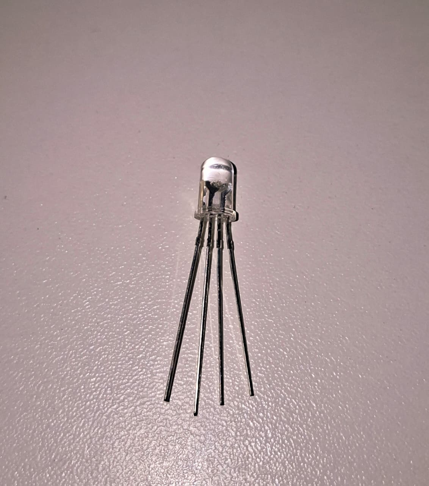
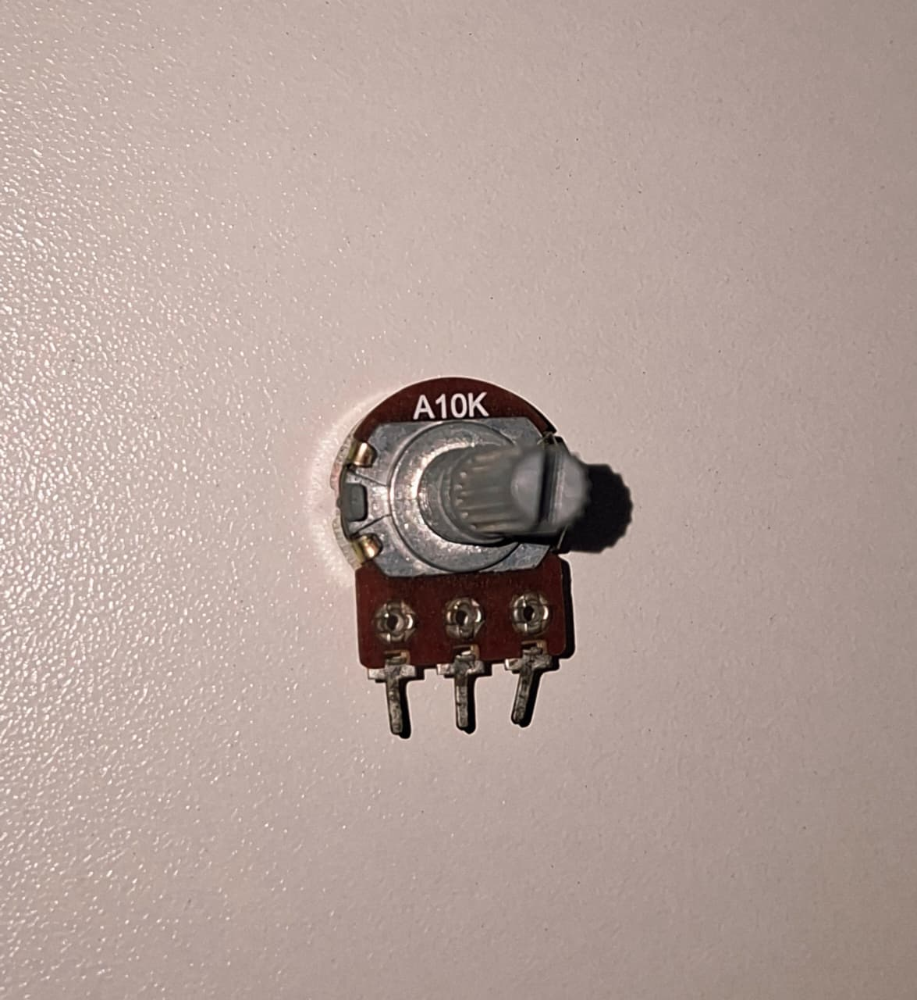
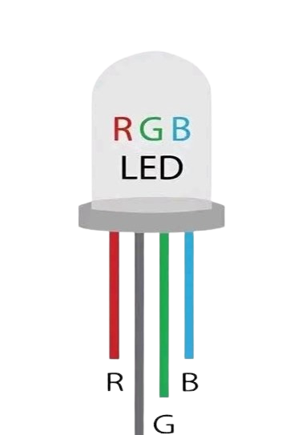
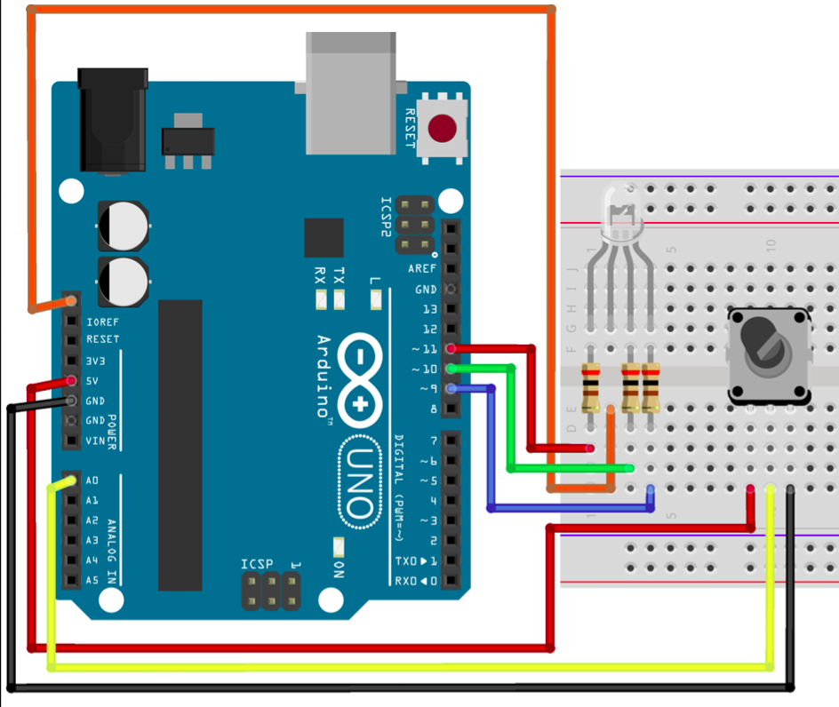

# LED RGB com Potenciômetro

O **LED RGB (Red, Green, Blue)** é um componente capaz de emitir diversas cores através da combinação das intensidades dos LEDs vermelho, verde e azul presentes em seu interior. Neste projeto, o Arduino utiliza um potenciômetro para controlar a intensidade de uma das cores do LED RGB, demonstrando o funcionamento da modulação por largura de pulso (PWM).

---

## Componentes Utilizados

| Quantidade | Componente |
| ---------- | ---------- |
| 1 | Arduino Uno |
| 1 | LED RGB (Ânodo Comum) |
| 3 | Resistores 300 Ω |
| 1 | Potenciômetro 10 kΩ |
| 7 | Jumpers Macho-Macho |
| 1 | Protoboard |
| 1 | Cabo USB A/B |

---

## Componentes

<p align="center">
<table>
<tr align="center">

<td>
<b>Arduino Uno</b><br>

</td>

<td>
<b>Protoboard</b><br>

</td>

<td>
<b>LED RGB</b><br>

</td>

<td>
<b>Potenciômetro</b><br>

</td>

<td>
<b>Resistores 300 Ω</b><br>

</td>

<td>
<b>Jumpers</b><br>

</td>

<td>
<b>Cabo USB A/B</b><br>

</td>

</tr>
</table>
</p>

---

## Como funciona o LED RGB?


Um LED RGB possui três LEDs internos: um vermelho (Red), um verde (Green) e um azul (Blue) e um terminal compartilhado. Variando a intensidade de cada um deles é possível produzir milhares de combinações de cores.

<p align="center">

</p>


Existem dois modelos de LED RGB:

- **Cátodo comum:** todos os LEDs compartilham o terminal negativo.
- **Ânodo comum:** todos os LEDs compartilham o terminal positivo.

Neste projeto foi utilizado um **LED RGB de ânodo comum**.
---

## Como funciona o Potenciômetro?

O potenciômetro é um resistor variável composto por uma trilha resistiva e um cursor móvel acionado por um eixo giratório.

Ao girar o eixo, a tensão presente no terminal central varia continuamente entre **0 V** e **5 V**.

O Arduino lê essa tensão através de uma entrada analógica utilizando a função `analogRead()`, obtendo valores entre **0** e **1023**.

Esses valores podem ser utilizados para controlar brilho, velocidade, posição de servo motores, volume e diversas outras aplicações.

---

## Ligações

### Potenciômetro

| Potenciômetro | Arduino |
| ------------- | -------- |
| Terminal esquerdo | 5V |
| Terminal central | A0 |
| Terminal direito | GND |

### LED RGB

| Terminal | Arduino |
| -------- | -------- |
| Vermelho (R) | Pino 11 (PWM) |
| Verde (G) | Pino 10 (PWM) |
| Azul (B) | Pino 9 (PWM) |
| Cátodo comum | GND |

Cada cor possui um resistor de 300 Ω em série.

---

## Esquema do Circuito


**(Observação: Na imagem o terminal do LED RGB está ligado a um pino sem nome, mas é uma representação do 2º 5V que há em modelos de Arduino)*

---

## Funcionamento

Nesse circuito a tensão do potenciômetro é lida pela entrada analógica A0 utilizando a função `analogRead()`, que converte a tensão em um valor inteiro entre **0** e **1023**.

Entretanto, a função `analogWrite()`, utilizada para controlar a intensidade dos LEDs através de **PWM (Pulse Width Modulation)**, aceita apenas valores entre **0** e **255**.

Para converter uma faixa na outra, utiliza-se a função:

```cpp
map(valor, 0, 1023, 0, 1535);
```

A função `map()` realiza uma conversão proporcional entre dois intervalos.

Neste projeto:

- **valor** → leitura obtida pelo `analogRead()`;
- **0 e 1023** → intervalo de entrada do conversor analógico do Arduino;
- **0 e 1535** → novo intervalo utilizado para percorrer todo o ciclo de cores do LED RGB.

O valor **1535** foi escolhido porque o gradiente completo é dividido em **6 regiões**, cada uma contendo **256 níveis de intensidade**:

| Faixa | Transição |
| ------ | --------- |
| 0 – 255 | Vermelho → Amarelo |
| 256 – 511 | Amarelo → Verde |
| 512 – 767 | Verde → Ciano |
| 768 – 1023 | Ciano → Azul |
| 1024 – 1279 | Azul → Magenta |
| 1280 – 1535 | Magenta → Vermelho |

Em cada uma dessas regiões, o programa aumenta ou diminui a intensidade de apenas uma das três cores (vermelho, verde e azul), enquanto as demais permanecem constantes.

Por exemplo, na transição **Vermelho → Amarelo**, o LED vermelho permanece com intensidade máxima (**255**) enquanto a intensidade do LED verde aumenta gradualmente de **0** até **255**. Como a cor amarela é formada pela combinação de vermelho e verde, o LED muda suavemente de vermelho para amarelo.

Esse mesmo princípio é aplicado às demais regiões, produzindo uma transição contínua por todo o espectro de cores do LED RGB conforme o potenciômetro é girado.

---

## Demonstração

[Vídeo de funcionamento](circuito/ledRGB.mp4)

---

## Código Fonte

[Código-fonte](codigo.ino)