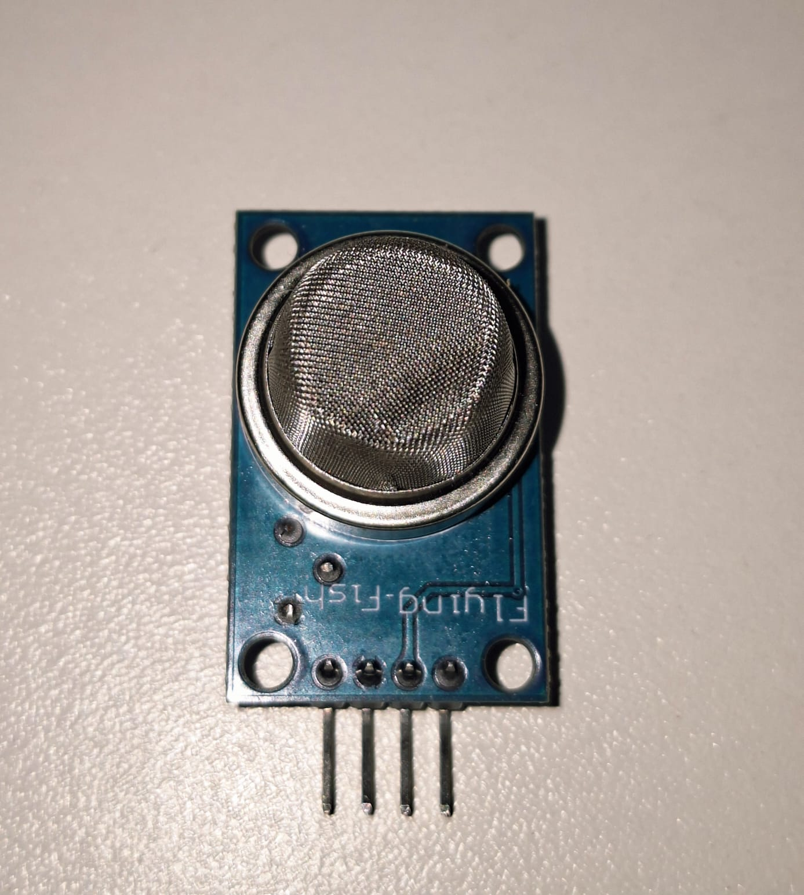
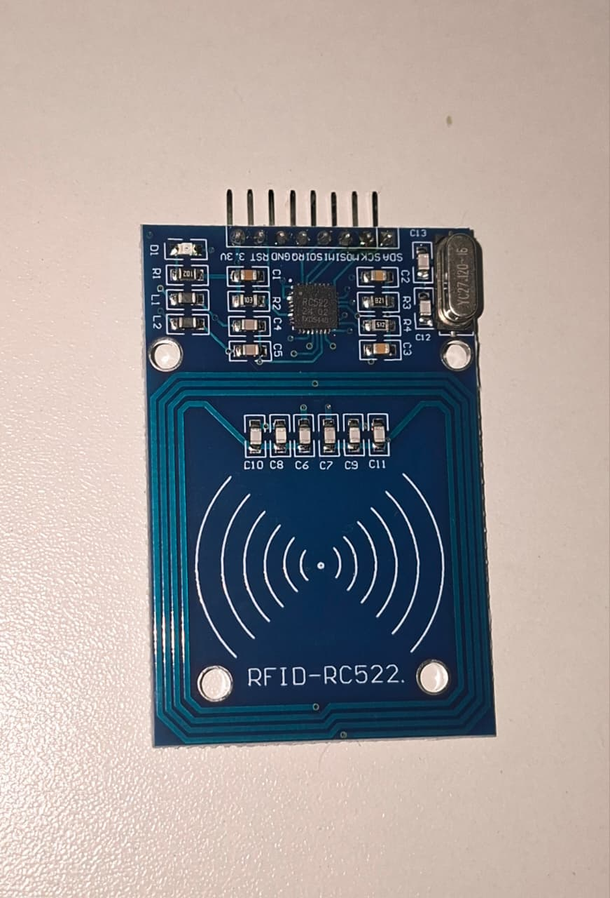

# Arduino Básico

Este repositório reúne diversos projetos desenvolvidos com **Arduino Uno** e componentes eletrônicos básicos, tendo como objetivo apresentar o funcionamento individual de cada sensor, módulo e atuador.

Cada projeto contém:

-  Explicação teórica do componente;
-  Tabela de ligações;
-  Esquema do circuito;
-  Vídeo de demonstração;
-  Código-fonte Comentado.

A proposta é aprender o funcionamento de cada componente separadamente para, posteriormente, combiná-los em projetos mais completos, como sistemas de automação, robótica, Internet das Coisas (IoT), monitoramento ambiental, controle de acesso e diversas outras aplicações.

---

# Arduino IDE

Todos os códigos deste repositório foram desenvolvidos utilizando a **Arduino IDE**.

Antes de executar qualquer projeto é necessário:

- Instalar a Arduino IDE;
- Selecionar a placa **Arduino Uno**;
- Selecionar a porta serial correspondente;
- Instalar as bibliotecas utilizadas quando necessário.

Após isso, basta abrir o arquivo **`.ino`** presente na pasta do projeto e realizar o upload para a placa.

---

# Estrutura do Repositório

Cada pasta representa um projeto independente.

```text
ArduinoBasico/
│
├── HelloWorld/
├── SensorLDR/
├── SensorPIR/
├── SensorUltrassonico/
├── SensorTemperatura_Umidade/
├── SensorSolo/
├── SensorGas/
├── SensorInclinacao/
├── SensorInfravermelho_ServoMotor/
├── LedRGB/
├── RFID/
├── DisplayLCD/
```

---

# Projetos

<table>

<tr>

<td align="center">
<a href="./HelloWorld">
<br>
<b>Hello World</b>
</a>
</td>

<td align="center">
<a href="./SensorLDR">
<br>
<b>Sensor LDR</b>
</a>
</td>

<td align="center">
<a href="./SensorPIR">
<br>
<b>Sensor PIR</b>
</a>
</td>

<td align="center">
<a href="./SensorUltrassonico">
<br>
<b>Sensor Ultrassônico</b>
</a>
</td>

</tr>

<tr>

<td align="center">
<a href="./SensorTemperatura_Umidade">
<br>
<b>DHT11</b>
</a>
</td>

<td align="center">
<a href="./SensorSolo">
<br>
<b>Sensor de Umidade do Solo</b>
</a>
</td>

<td align="center">
<a href="./SensorGas">
<br>
<b>Sensor de Gás</b>
</a>
</td>

<td align="center">
<a href="./SensorInclinacao">
<br>
<b>Sensor de Inclinação</b>
</a>
</td>

</tr>

<tr>

<td align="center">
<a href="./SensorInfravermelho_ServoMotor">
<br>
<b>Sensor Infravermelho + Servo</b>
</a>
</td>

<td align="center">
<a href="./LedRGB">
<br>
<b>LED RGB</b>
</a>
</td>

<td align="center">
<a href="./RFID">
<br>
<b>RFID RC522</b>
</a>
</td>

<td align="center">
<a href="./DisplayLCD">
<br>
<b>Display LCD</b>
</a>
</td>

</tr>

</table>

---

# Objetivos

# Aprenda Arduino e Robótica

A robótica está presente em diversas áreas do nosso cotidiano, desde sistemas de automação residencial até aplicações industriais, agrícolas, médicas e educacionais. O Arduino é uma das plataformas mais utilizadas para dar os primeiros passos nesse universo, pois permite aprender eletrônica e programação de forma prática e acessível. Agradeço ao programa Seguir Transformando Através da Robótica e outras Tecnologias (START) <a href="https://numbers.ifg.edu.br/start"> por ter me dado a oportunidade de aprofundar nesse mundo como monitor.

Este repositório foi desenvolvido com o objetivo de servir como uma coleção de exemplos básicos utilizando sensores, módulos e atuadores amplamente empregados em projetos de robótica e sistemas embarcados. Cada projeto aborda um componente de forma individual, permitindo compreender seu funcionamento antes de integrá-lo a aplicações mais complexas.

A partir desses conhecimentos, torna-se possível desenvolver projetos envolvendo automação, Internet das Coisas (IoT), monitoramento ambiental, controle de acesso, robótica móvel, casas inteligentes e inúmeras outras soluções baseadas em microcontroladores.

Se este repositório ajudar você a dar os primeiros passos no mundo da robótica, então ele já terá cumprido seu propósito.

---

# Tecnologias Utilizadas

- Arduino Uno
- Linguagem C/C++
- Arduino IDE

---
