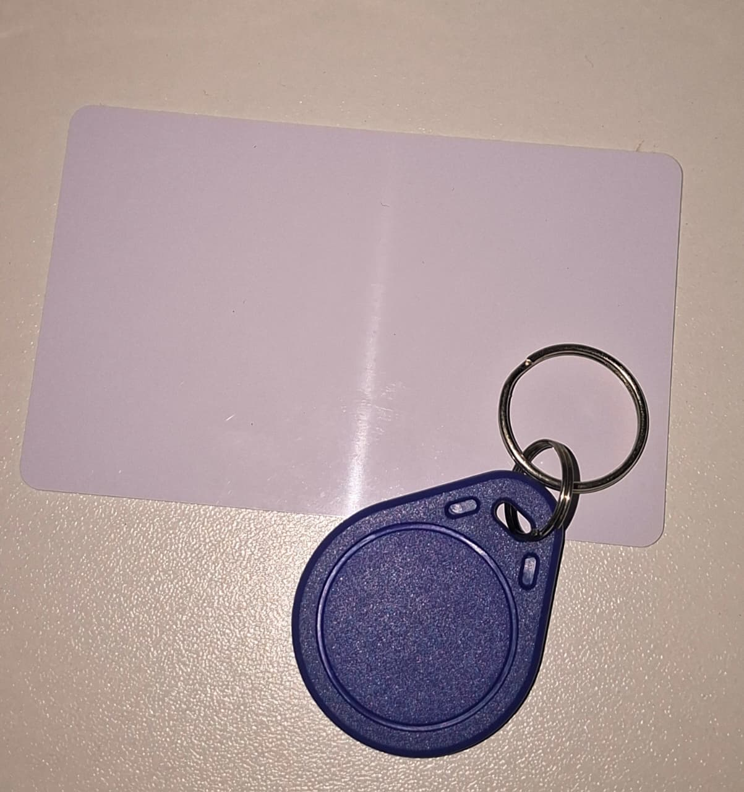

# Módulo RFID RC522

O **RFID RC522** é um módulo utilizado para leitura e gravação de cartões e tags RFID que operam na frequência de **13,56 MHz**. Neste projeto, o objetivo é realizar a leitura do **UID (Unique Identifier)** de cartões e tags RFID, exibindo essas informações no **Monitor Serial** para que possam ser utilizadas posteriormente em projetos de autenticação e controle de acesso.

Este é um dos primeiros projetos recomendados para quem está iniciando com RFID, pois a leitura do UID é a base para diversas aplicações utilizando Arduino.

---

## Componentes Utilizados

| Quantidade | Componente |
| ---------- | ---------- |
| 1 | Arduino Uno |
| 1 | Módulo RFID RC522 |
| 1 | Cartão RFID |
| 1 | Tag RFID (Chaveiro) |
| 7 | Jumpers Macho-Macho |
| 1 | Cabo USB A/B |

---

## Componentes

<p align="center">
<table>
<tr align="center">

<td>
<b>Arduino Uno</b><br>

</td>

<td>
<b>Módulo RFID RC522</b><br>

</td>

<td>
<b>Cartão e Tag RFID</b><br>

</td>

<td>
<b>Jumpers</b><br>

</td>

<td>
<b>Cabo USB A/B</b><br>

</td>

</tr>
</table>
</p>

---

## Como funciona o RFID?

RFID (**Radio Frequency Identification**) é uma tecnologia que utiliza ondas de rádio para identificar objetos sem a necessidade de contato físico.

O sistema é composto por dois elementos principais:

- **Leitor RFID (RC522):** responsável por gerar o campo eletromagnético e realizar a comunicação.
- **Tag ou Cartão RFID:** possui um pequeno chip e uma antena capazes de responder ao leitor enviando suas informações.

Quando um cartão ou tag é aproximado do módulo RC522, o leitor energiza o chip interno através do campo eletromagnético e inicia a comunicação, recebendo seus dados de identificação.

---

## O que é o UID?

Cada cartão ou tag RFID possui um **UID (Unique Identifier)**, que é um número de identificação único gravado pelo fabricante.

Esse código funciona como uma espécie de **"CPF"** do cartão, permitindo diferenciá-lo dos demais.

Por exemplo:

```text
UID: F3 A8 42 1B
```

ou

```text
UID: 04 8C 9D 72 B4 61 80
```

O UID normalmente é utilizado para:

- Controle de acesso;
- Fechaduras eletrônicas;
- Registro de presença;
- Sistemas de autenticação;
- Automação residencial;
- Controle de estoque.

Neste projeto, o objetivo é apenas identificar e exibir o UID dos cartões e tags no Monitor Serial para que esses valores possam ser utilizados em projetos futuros.

---

## Comunicação SPI

O módulo RC522 utiliza o protocolo de comunicação **SPI (Serial Peripheral Interface)** para trocar informações com o Arduino.

Nesse protocolo existem quatro sinais principais:

- **MOSI (Master Out Slave In):** envia dados do Arduino para o RC522.
- **MISO (Master In Slave Out):** envia dados do RC522 para o Arduino.
- **SCK (Serial Clock):** sincroniza a comunicação.
- **SS (Slave Select):** seleciona o dispositivo SPI que será utilizado.

---

## Ligações

| Pinos do RC522 | Arduino Uno |
| -------------- | ----------- |
| 3.3 V | 3.3 V |
| RST | Pino 9 |
| GND | GND |
| IRQ | Não conectado |
| MISO | Pino 12 |
| MOSI | Pino 11 |
| SCK | Pino 13 |
| SDA (SS) | Pino 10 |

> **Importante:** O módulo RC522 deve ser alimentado com **3,3 V**. A utilização de **5 V** pode danificar o dispositivo.

---

## Esquema do Circuito


---

## Funcionamento

Após inicializar o módulo RFID, o Arduino permanece aguardando a aproximação de um cartão ou tag.

Quando um dispositivo RFID é detectado, o RC522 realiza a leitura do seu UID e envia essas informações ao Arduino através da comunicação SPI.

O programa então exibe o UID no **Monitor Serial**, permitindo identificar cada cartão individualmente.

Esse procedimento pode ser repetido quantas vezes forem necessárias, possibilitando cadastrar diferentes cartões para utilização em projetos futuros, como controle de acesso, fechaduras eletrônicas ou autenticação de usuários.

---

## Bibliotecas Utilizadas

Para facilitar a comunicação com o módulo RFID foram utilizadas as seguintes bibliotecas:

```cpp
#include <SPI.h>
#include <MFRC522.h>
```

A biblioteca **SPI** implementa o protocolo de comunicação utilizado pelo RC522, enquanto a biblioteca **MFRC522** disponibiliza funções prontas para inicializar o módulo, detectar cartões e realizar a leitura do UID.

---

## Demonstração

[Vídeo de funcionamento](circuito/RFID.mp4)

---

## Código Fonte

[Código-fonte](codigo/codigo.ino)