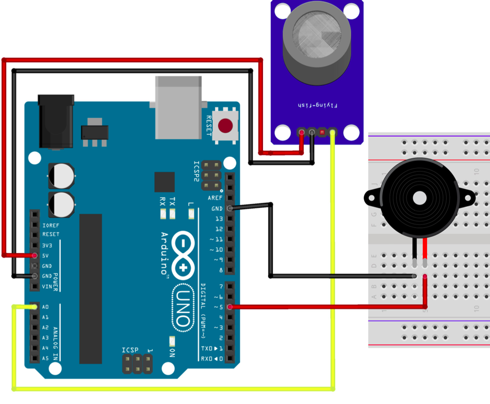

# Sensor de Gás

O Módulo de Sensor de Gás MQ-2 é capaz de detectar a presença de gases inflamáveis e fumaça no ambiente através da variação de sua resistência interna. Neste circuito, o Arduino monitora continuamente o sensor e, quando a concentração de gás ultrapassa um determinado limite, um buzzer é acionado para emitir um alerta sonoro.

---

## Componentes Utilizados

| Quantidade | Componente           |
| ---------- | -------------------- |
| 1          | Arduino Uno          |
| 1          | Módulo Sensor de Gás MQ-2 |
| 1          | Buzzer               |
| 2          | Jumpers Macho-Macho  |
| 3          | Jumpers Fêmea-Macho  |
| 1          | Protoboard           |
| 1          | Cabo USB A/B         |

---

## Componentes

<table>
<tr align="center">

<td>
<b>Arduino Uno</b> 

</td>

<td>
<b>Protoboard</b> 

</td>

<td>
<b>Sensor de Gás MQ-2</b> 

</td>

<td>
<b>Buzzer</b> 

</td>

<td>
<b>Jumpers Macho-Macho</b> 

</td>

<td>
<b>Jumpers Fêmea-Macho</b> 

</td>

<td>
<b>Cabo USB A/B</b> 

</td>

</tr>
</table>

---

## Ligações

### Sensor de Gás

| Sensor | Arduino |
| ------ | ------- |
| VCC    | 5V      |
| GND    | GND     |
| AO     | A0      |

### Buzzer

| Componente        | Arduino        |
| ----------------- | -------------- |
| Pino positivo (+) | Pino Digital 6 |
| Pino negativo (-) | GND            |

---

## Esquema do Circuito

---

## Funcionamento

O Arduino realiza continuamente a leitura do valor analógico fornecido pelo sensor de gás através do pino A0.
Quando a concentração de gás ultrapassa o limite de 500 definido no código, o Arduino envia 5v pro Buzzer que é acionado, emitindo um alerta sonoro para indicar uma situação de risco, quando os níveis retornam ao valor considerado seguro, o buzzer é desligado automaticamente.

---

## Demonstração

[Vídeo de funcionamento](circuito/sensorGas.mp4)

---

## Código Fonte

[Código-fonte](codigo.ino)
