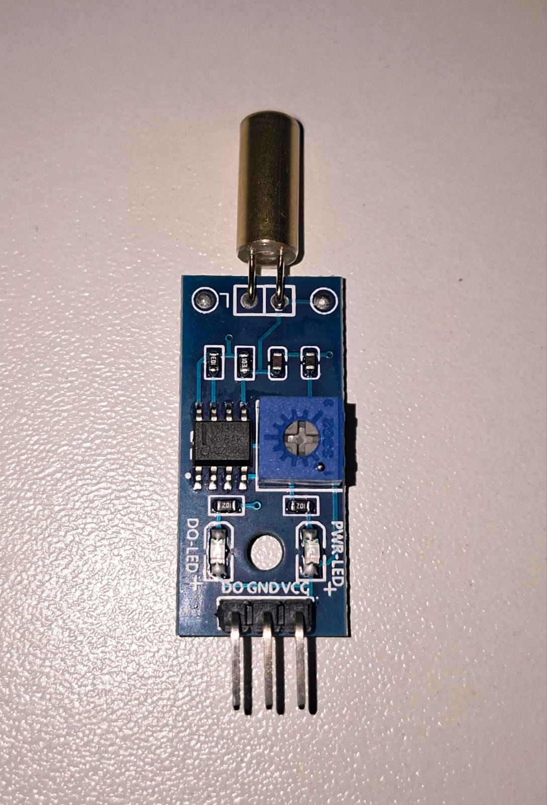
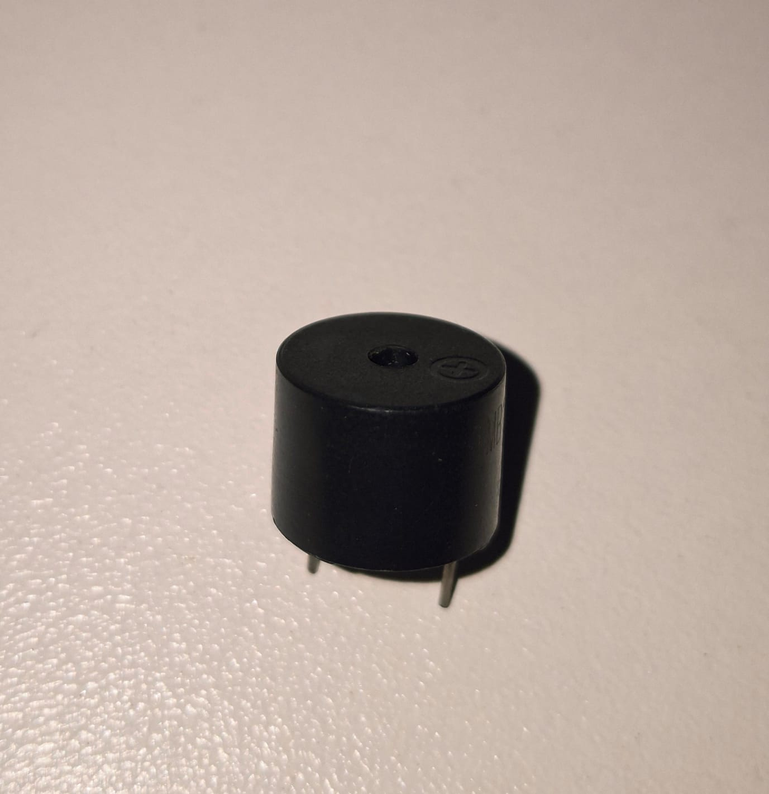
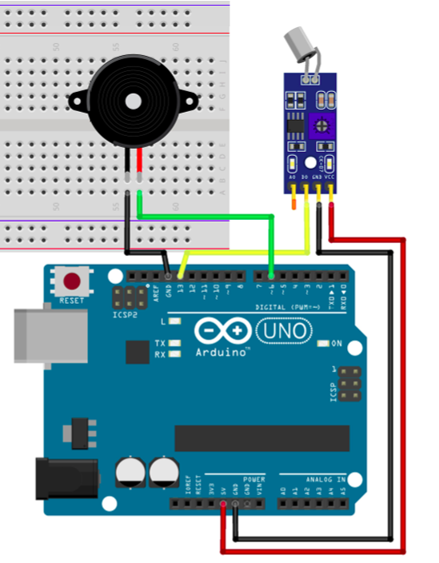

# Sensor de Inclinação

O Sensor de Inclinação é um dispositivo capaz de detectar alterações na posição ou inclinação de um objeto. Dentro do cilindro existe uma pequena esfera condutora, quando o sensor está reto, a esfera encosta em dois contatos metálicos, a esfera rola para o outro lado. Os contatos deixam de se tocar, o circuito abre, é exatamente como um interruptor liga/desliga.
Ela fecha o circuito elétrico. Neste circuito, o Arduino monitora continuamente o estado do sensor e, quando uma inclinação é detectada, um buzzer é acionado para emitir um alerta sonoro.

---

## Componentes Utilizados

| Quantidade | Componente                  |
| ---------- | --------------------------- |
| 1          | Arduino Uno                 |
| 1          | Módulo Sensor de Inclinação |
| 1          | Buzzer                      |
| 2          | Jumpers Macho-Macho         |
| 3          | Jumpers Fêmea-Macho         |
| 1          | Protoboard                  |
| 1          | Cabo USB A/B                |

---

## Componentes

<table>
<tr align="center">

<td>
<b>Arduino Uno</b> 

</td>

<td>
<b>Protoboard</b> 

</td>

<td>
<b>Sensor de Inclinação</b> 

</td>

<td>
<b>Buzzer</b> 

</td>

<td>
<b>Jumpers Macho-Macho</b> 

</td>

<td>
<b>Jumpers Fêmea-Macho</b> 

</td>

<td>
<b>Cabo USB A/B</b> 

</td>

</tr>
</table>

---

## Ligações

### Sensor de Inclinação

| Sensor | Arduino        |
| ------ | -------------- |
| VCC    | 5V             |
| GND    | GND            |
| DO     | Pino Digital 13 |

### Buzzer

| Componente        | Arduino        |
| ----------------- | -------------- |
| Pino positivo (+) | Pino Digital 6 |
| Pino negativo (-) | GND            |

---

## Esquema do Circuito

---

## Funcionamento

O Arduino monitora continuamente o estado do sensor de inclinação através da saída digital (DO).

Enquanto o sensor permanece na posição considerada estável, o buzzer permanece desligado. Quando o módulo detecta uma inclinação, sua saída digital muda de estado e o Arduino aciona o buzzer, emitindo um alerta sonoro.

Ao retornar à posição inicial, o buzzer é desligado automaticamente.

---

## Demonstração

[Vídeo de funcionamento](circuito/sensorInclinacao.mp4)

---

## Código Fonte

[Código-fonte](codigo.ino)
