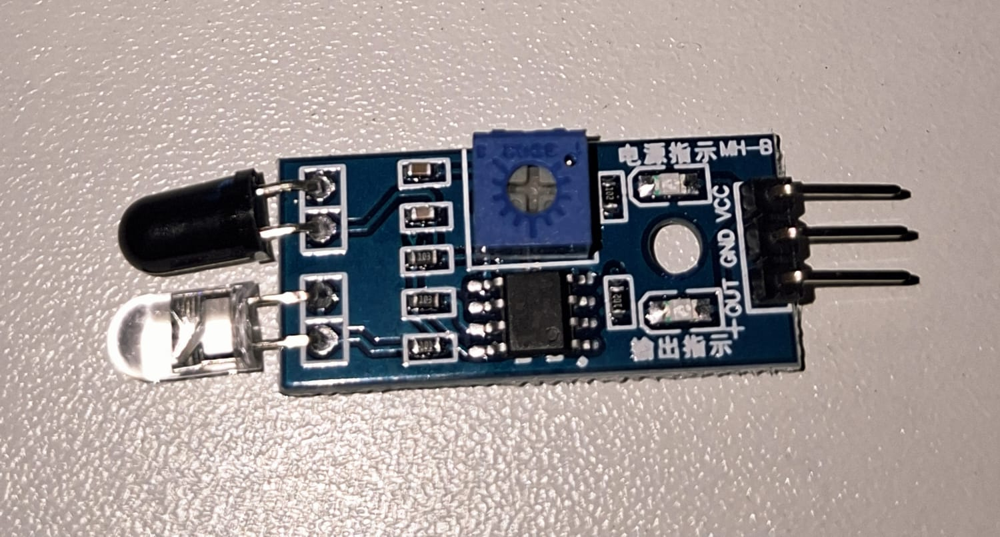
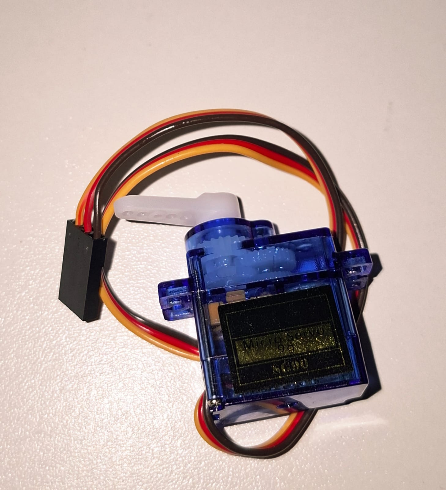
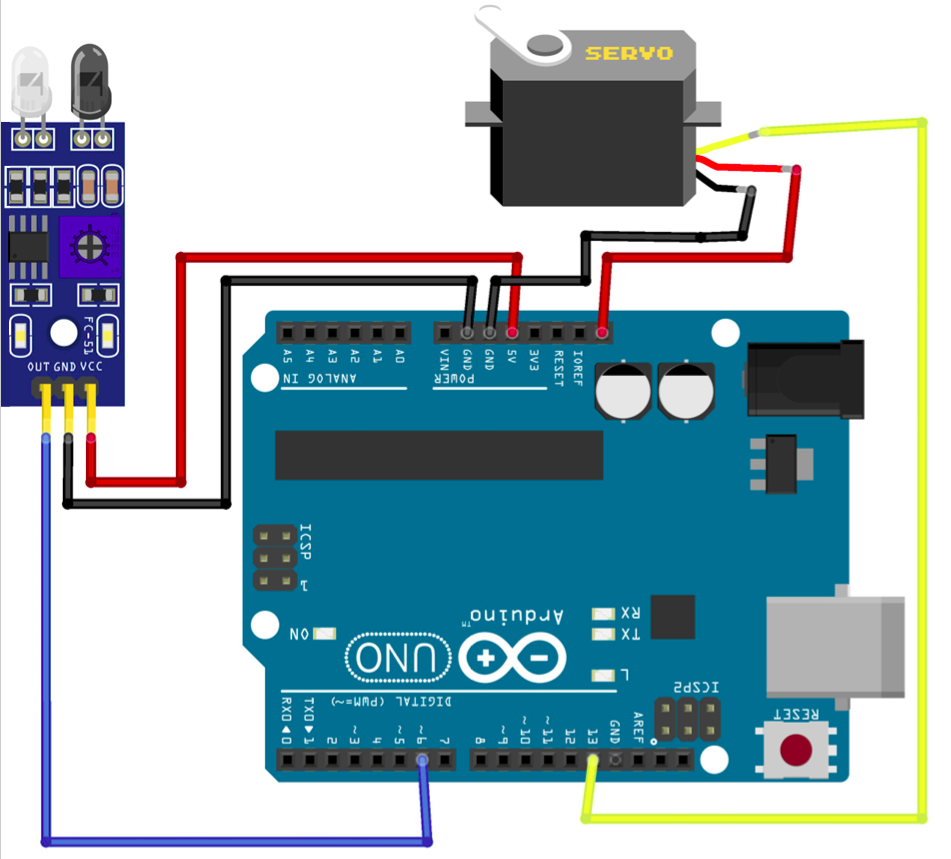

# Sensor Infravermelho + Servo Motor

O sensor Infravermelho (IR) é um dispositivo capaz de detectar a presença de objetos através da emissão e recepção de luz infravermelha, normalmente retornando LOW quando se detecta objetos. Neste projeto, o Arduino realiza a leitura do sensor e controla o movimento de um Servo Motor de acordo com a detecção de um objeto.

Quando o sensor identifica a presença de um obstáculo, o Arduino envia um comando para o Servo Motor alterar sua posição. Caso contrário, o servo permanece na posição inicial. O Interessante desse circuito é que conseguimos montar sem a presença de uma protoboard. Como estamos usando dois componetes, precisamos de 2 entradas 5v e o Arduino Uno atende essa quantidade.

E qual a diferença desse sensor com o sensor Ultrassônico?
O Ultrassonico usa um som de alta frequência, usa o mesmo principio de ir e voltar com o trigger emitindo som e o echo sendo receptor, sendo a maior diferença a questão que ele mede o tempo que esse eco percorreu, ou seja, não retorna a distância de fato, mas é possível obtê-la a partir de calculos. 

Já o sensor Infravermelho nos retorna direto se tem ou não algum objeto detectado atravéz de HIGH ou LOW.

---

## Componentes Utilizados

| Quantidade | Componente                    |
| ---------- | ----------------------------- |
| 1          | Arduino Uno                   |
| 1          | Módulo Sensor Infravermelho   |
| 1          | Servo Motor SG90              |
| 3          | Jumpers Macho-Macho           |
| 3          | Jumpers Fêmea-Macho           |
| 1          | Cabo USB A/B                  |

---

## Componentes

<table>
<tr align="center">

<td>
<b>Arduino Uno</b> 

</td>

<td>
<b>Protoboard</b> 

</td>

<td>
<b>Sensor Infravermelho</b> 

</td>

<td>
<b>Servo Motor</b> 

</td>

<td>
<b>Jumpers Macho-Macho</b> 

</td>

<td>
<b>Jumpers Fêmea-Macho</b> 

</td>

<td>
<b>Cabo USB A/B</b> 

</td>

</tr>
</table>

---

## Ligações

### Sensor Infravermelho

| Componente do Sensor IR | Arduino |
| ----------------------- | ------- |
| VCC                     | 5V      |
| GND                     | GND     |
| OUT                     | Pino Digital 6 |

### Servo Motor

| Componente do Servo | Arduino |
| ------------------- | ------- |
| VCC (Vermelho)      | 5V      |
| GND (Marrom/Preto)  | GND     |
| Sinal (Amarelo/Laranja) | Pino Digital 13 |

---

## Esquema do Circuito

---

## Funcionamento

O Arduino realiza continuamente a leitura do sinal digital enviado pelo sensor infravermelho através do pino digital 6.

O módulo IR possui um transmissor e um receptor infravermelho. Quando um objeto se aproxima, o sinal infravermelho emitido é refletido e detectado pelo receptor, alterando o estado da saída digital do sensor.

Quando o objeto é detectado, o Arduino envia um comando utilizando a biblioteca Servo.h, movimentando o servo motor em 180°, caso nenhum objeto seja identificado, o servo permanece em sua posição inicial.

---

## Demonstração

[Vídeo de funcionamento](circuito/sensorInfravermelho_servoMotor.mp4)

---

## Código Fonte

[Código-fonte](codigo/codigo.ino)