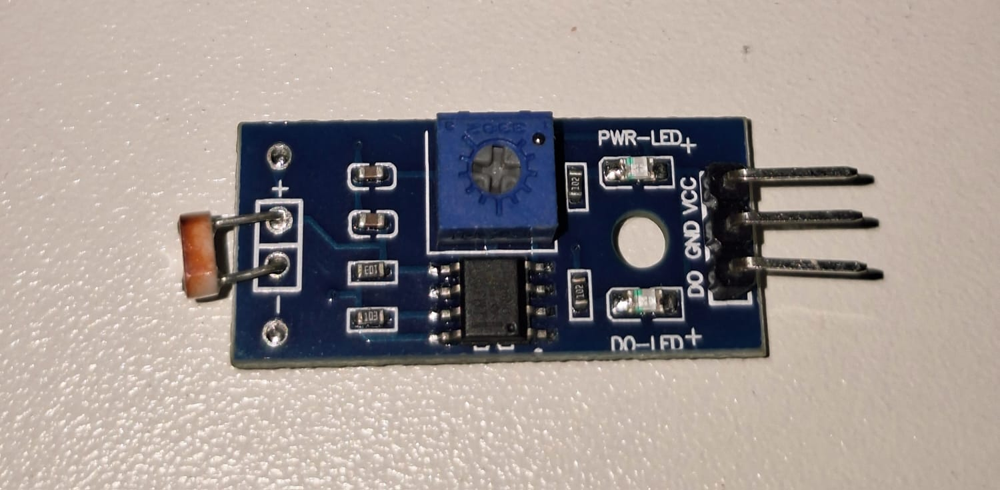
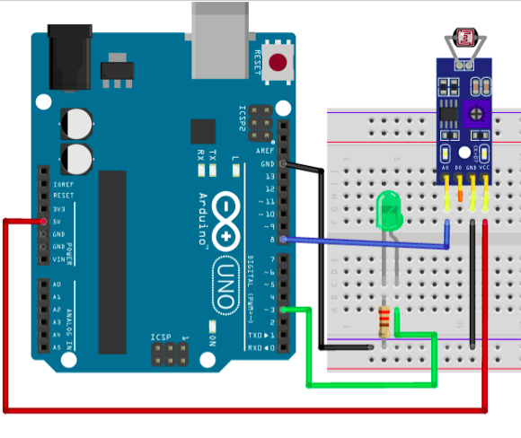

# Sensor LDR

O sensor LDR (Light Dependent Resistor) é um sensor cuja resistência elétrica varia conforme a intensidade da luz incidente. Neste projeto, o Arduino realiza a leitura da luminosidade do ambiente atravéz do módulo do sensor e controla o acionamento de um LED de acordo com o valor detectado.

---

## Componentes Utilizados

| Quantidade | Componente        |
| ---------- | ----------------- |
| 1          | Arduino Uno       |
| 1          | Módulo Sensor LDR |
| 1          | LED               |
| 1          | Resistor 300 Ω    |
| 5          | Jumpers           |
| 1          | Protoboard        |
| 1          | Cabo USB A/B      |

---

## Componentes

<table>
<tr align="center">

<td>
<b>Arduino Uno</b> 

</td>

<td>
<b>Protoboard</b> 

</td>

<td>
<b>Sensor LDR</b> 

</td>

<td>
<b>LED</b> 

</td>

<td>
<b>Resistor 300 Ω</b> 

</td>

<td>
<b>Jumpers</b> 

</td>

<td>
<b>Cabo USB A/B</b> 

</td>

</tr>
</table>

---

## Ligações

| Componente           | Arduino              |
| -------------------- | -------------------- |
| VCC do módulo LDR    | 5V                   |
| GND do módulo LDR    | GND                  |
| D0 (Saída Digital)           | D0           |
| Ânodo (+) do LED     | Pino Digital 2       |
| Cátodo (-) do LED    | Resistor 300 Ω → GND |

---

## Esquema do Circuito

---

## Funcionamento

O Arduino realiza continuamente a leitura do valor analógico fornecido pelo sensor LDR através do pino **D0** (Nesse módulo, esse terminal também pode ser usado para leituras tantos digitais quanto analógicas).

Quando a intensidade luminosa do ambiente fica abaixo do limite definido no código, o LED é acionado, indicando baixa luminosidade. Caso contrário, o LED permanece apagado.

---

## Demonstração

[Vídeo do funcionamento](circuito/sensorLDR.mp4)

---

## Código Fonte

[Código-fonte](codigo/codigo.ino)
