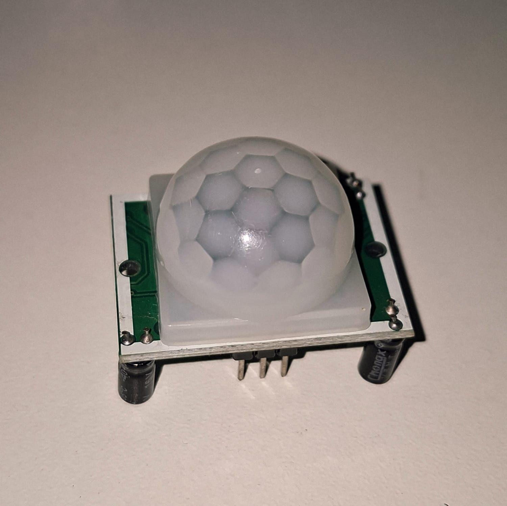
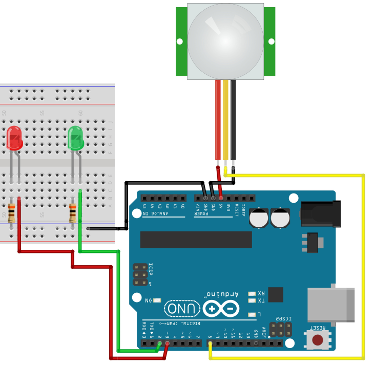

# Sensor PIR

O sensor PIR (Passive Infrared Sensor) é um dispositivo capaz de detectar movimento através da variação da radiação infravermelha emitida por corpos quentes. Neste circuito, o Arduino monitora continuamente o sensor PIR e controla dois LEDs para indicar a presença ou ausência de movimento. Quando um movimento é detectado, o LED verde é aceso e o LED vermelho é apagado. Na ausência de movimento, o LED vermelho permanece aceso enquanto o LED verde permanece apagado.

---

## Componentes Utilizados

| Quantidade | Componente        |
| ---------- | ----------------- |
| 1          | Arduino Uno       |
| 1          | Sensor PIR HC-SR501 |
| 1          | LED Vermelho      |
| 1          | LED Verde         |
| 2          | Resistores 300 Ω  |
| 3          | Jumpers Macho-Macho |
| 3          | Jumpers Fêmea-Macho |
| 1          | Protoboard        |
| 1          | Cabo USB A/B      |

---

## Componentes

<table>
<tr align="center">

<td>
<b>Arduino Uno</b> 

</td>

<td>
<b>Protoboard</b> 

</td>

<td>
<b>Sensor PIR</b> 

</td>

<td>
<b>LED</b> 

</td>

<td>
<b>Resistor 300 Ω</b> 

</td>

<td>
<b>Jumpers Macho-Macho</b> 

</td>

<td>
<b>Jumpers Fêmea-Macho</b> 

</td>

<td>
<b>Cabo USB A/B</b> 

</td>

</tr>
</table>

---

## Ligações

| Componente | Arduino |
| ---------- | -------- |
| VCC do Sensor PIR | 5V |
| GND do Sensor PIR | GND |
| OUT do Sensor PIR | Pino Digital 8 |
| Ânodo (+) do LED Vermelho | Pino Digital 3 |
| Cátodo (-) do LED Vermelho | Resistor 300 Ω → GND |
| Ânodo (+) do LED Verde | Pino Digital 2 |
| Cátodo (-) do LED Verde | Resistor 300 Ω → GND |

---

## Esquema do Circuito

---

## Funcionamento

O Arduino realiza continuamente a leitura da saída digital do sensor PIR através do pino digital 8. O sensor PIR detecta alterações na radiação infravermelha do ambiente causadas pela movimentação de pessoas ou outros corpos quentes. Quando um movimento é identificado, a saída do sensor passa para nível lógico alto (HIGH).

Ao detectar movimento, o Arduino envia 5v para o LED Verde e apaga o LED vermelho, indicando que há presença de movimento no ambiente. Quando não há movimento detectado, o sensor retorna ao estado de repouso (LOW), fazendo com que o LED vermelho permaneça aceso e o LED verde apagado.

---

## Demonstração

[Vídeo de funcionamento](circuito/SensorPIR.mp4)

---

## Código Fonte

[Código-fonte](codigo/codigo.ino)