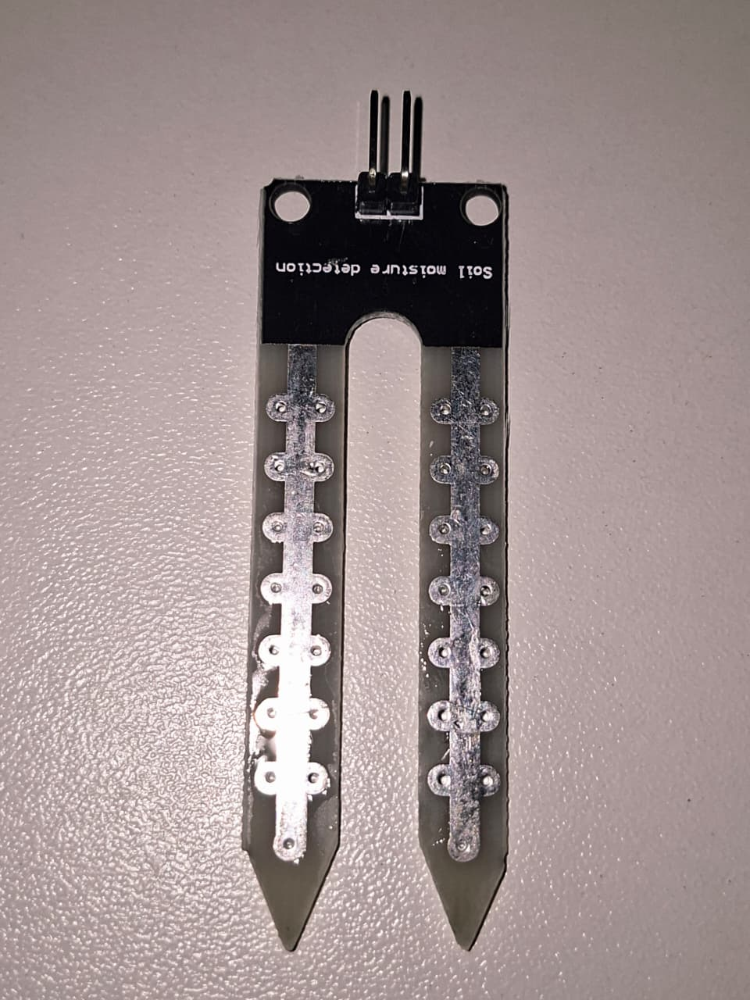
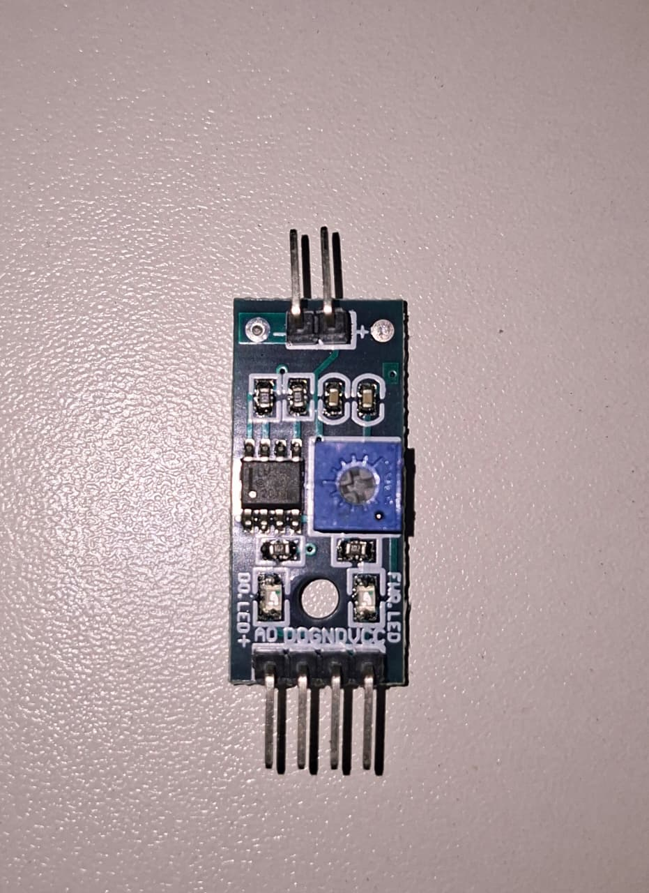
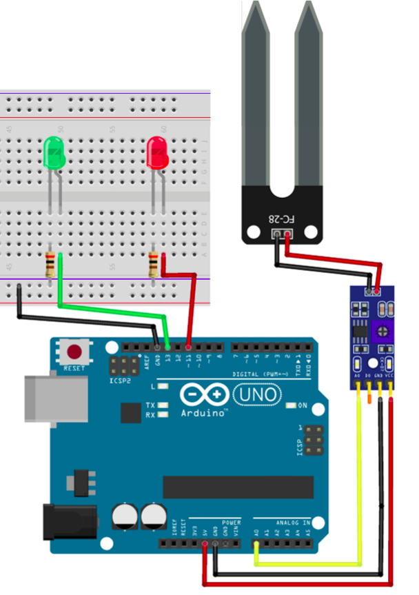

# Sensor de Umidade do Solo

O Sensor de Umidade do Solo é utilizado para medir a quantidade de umidade presente na terra através da condutividade elétrica entre suas hastes metálicas. Neste circuito, o Arduino monitora continuamente a umidade do solo e indica seu estado por meio de dois LEDs.
Quando a umidade é suficiente, o LED verde permanece aceso. Caso o solo esteja seco, o LED vermelho é acionado, indicando a necessidade de irrigação.

---

## Componentes Utilizados

| Quantidade | Componente                |
| ---------- | ------------------------- |
| 1          | Arduino Uno               |
| 1          | Sensor de Umidade do Solo |
| 1          | Módulo Comparador LM393   |
| 1          | LED Verde                 |
| 1          | LED Vermelho              |
| 2          | Resistores 300 Ω          |
| 3          | Jumpers Fêmea-Macho       |
| 3          | Jumpers Macho-Macho       |
| 1          | Protoboard                |
| 1          | Cabo USB A/B              |

---

## Componentes

<table>
<tr align="center">

<td>
<b>Arduino Uno</b> 

</td>

<td>
<b>Protoboard</b> 

</td>

<td>
<b>Sensor de Umidade</b> 

</td>

<td>
<b>Módulo LM393</b> 

</td>

<td>
<b>LEDs</b> 

</td>

<td>
<b>Resistores 300 Ω</b> 

</td>

<td>
<b>Jumpers Macho-Macho</b> 

</td>

<td>
<b>Jumpers Fêmea-Macho</b> 

</td>

<td>
<b>Cabo USB A/B</b> 

</td>

</tr>
</table>

---

## Ligações

### Sensor Solo

| Módulo | Módulo LM393 |
| ------ | ------- |
| Terminal 1    | (+)     |
| Terminal 2    | (-)     |

### Módulo Sensor Solo

| Módulo | Arduino |
| ------ | ------- |
| VCC    | 5V      |
| GND    | GND     |
| AO     | A0      |

### LEDs

| LED      | Arduino        |
| -------- | -------------- |
| Verde    | Pino Digital 13 |
| Vermelho | Pino Digital 12 |

---

## Esquema do Circuito

---

## Funcionamento

O sensor mede continuamente a umidade do solo através da resistência elétrica existente entre suas hastes. O valor lido é enviado ao Arduino pelo pino A0, onde é comparado com um limite no código.
A configuração de funcionamento segue:

*  LED Verde: solo com umidade adequada.
*  LED Vermelho: solo seco, indicando necessidade de irrigação.

---

## Demonstração

[Vídeo de funcionamento](circuito/sensorSolo.mp4)

---

## Código Fonte

[Código-fonte](codigo/codigo.ino)
