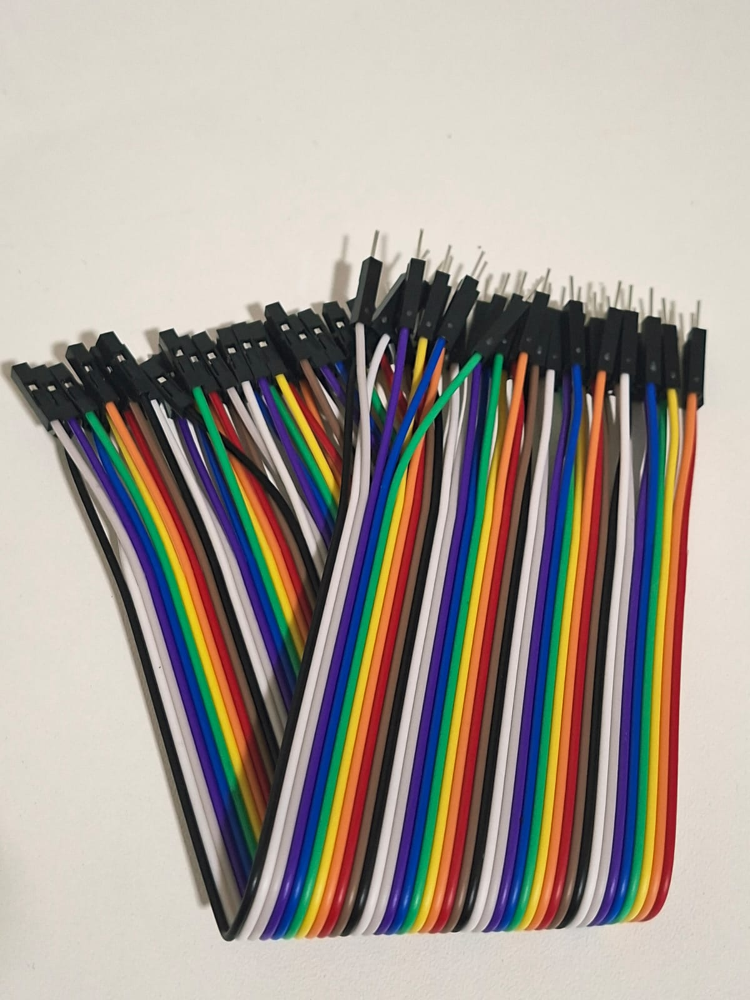
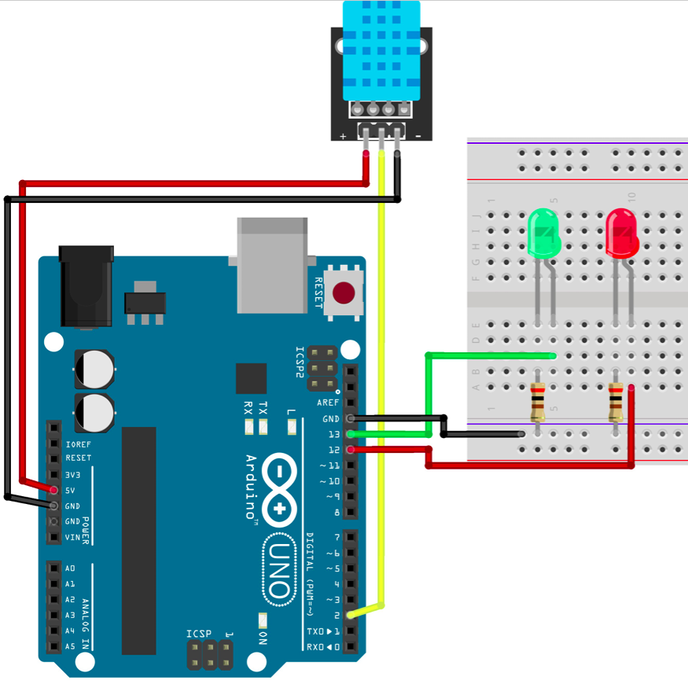

# Sensor de Temperatura e Umidade DHT11

O **DHT11** é um sensor capaz de medir temperatura e umidade relativa do ar. Neste projeto, o Arduino realiza a leitura da temperatura ambiente e utiliza dois LEDs para indicar se a temperatura está dentro de uma faixa considerada normal ou elevada.

## Como funciona o Sensor DHT11?

O DHT11 é um sensor digital que mede duas grandezas ambientais:

- **Temperatura (°C);**
- **Umidade relativa do ar (%).**

Internamente, o módulo é composto por:

- Um **termistor NTC**, responsável por medir a temperatura.
- Um **sensor capacitivo**, responsável por medir a umidade do ar.
- Um pequeno **microcontrolador**, que converte essas medições em um sinal digital enviado ao Arduino.

Ao contrário de sensores analógicos, o DHT11 transmite os dados por meio de um protocolo digital utilizando apenas um pino de comunicação.

---

## Bibliotecas Utilizadas

Para facilitar a comunicação com o sensor foram utilizadas as bibliotecas da Adafruit:

```cpp
#include <Adafruit_Sensor.h>
#include <DHT.h>
#include <DHT_U.h>
```

Essas bibliotecas implementam toda a comunicação com o DHT11, permitindo que o Arduino leia diretamente os valores de temperatura e umidade sem a necessidade de manipular o protocolo manualmente.

---

## Componentes Utilizados

| Quantidade | Componente |
| ---------- | ---------- |
| 1 | Arduino Uno |
| 1 | Módulo Sensor DHT11 |
| 1 | LED Verde |
| 1 | LED Vermelho |
| 2 | Resistores 300 Ω |
| 3 | Jumpers Macho-Macho |
| 3 | Jumpers Fêmea-Macho |
| 1 | Protoboard |
| 1 | Cabo USB A/B |

---

## Componentes

<p align="center">
<table>
<tr align="center">

<td>
<b>Arduino Uno</b><br>

</td>

<td>
<b>Protoboard</b><br>

</td>

<td>
<b>Sensor DHT11</b><br>

</td>

<td>
<b>LEDs</b><br>

</td>

<td>
<b>Resistores 300 Ω</b><br>

</td>

<td>
<b>Jumpers Macho-Macho</b><br>

</td>

<td>
<b>Jumpers Fêmea-Macho</b><br>

</td>

<td>
<b>Cabo USB A/B</b><br>

</td>

</tr>
</table>
</p>

---

## Ligações

### Sensor DHT11

| Sensor | Arduino |
| ------- | -------- |
| VCC | 5V |
| GND | GND |
| DATA | Pino Digital 2 |

### LEDs

| LED | Arduino |
| --- | -------- |
| Verde | Pino Digital 13 |
| Vermelho | Pino Digital 12 |

Cada LED possui um resistor de 300 Ω ligado em série.

---

## Esquema do Circuito



---

## Funcionamento

Durante a execução do programa, o Arduino realiza continuamente a leitura da temperatura utilizando o sensor DHT11.

Após cada leitura, a temperatura obtida é comparada com o limite definido no programa (30 °C).

O comportamento do circuito é o seguinte:

| Temperatura | LED Verde | LED Vermelho |
| ------------ | --------- | ------------ |
| Menor que 30 °C | Led Verde Ligado | Led Vermelho Desligado |
| Maior ou igual a 30 °C | Led Verde Desligado | Led Vermelho Ligado |

Além da indicação visual através dos LEDs, os valores de temperatura também podem ser observados pelo Monitor Serial, permitindo acompanhar as medições em tempo real.

---

## Demonstração

[Vídeo de funcionamento](circuito/sensorDHT11.mp4)

---

## Código Fonte

[Código-fonte](codigo/codigo.ino)