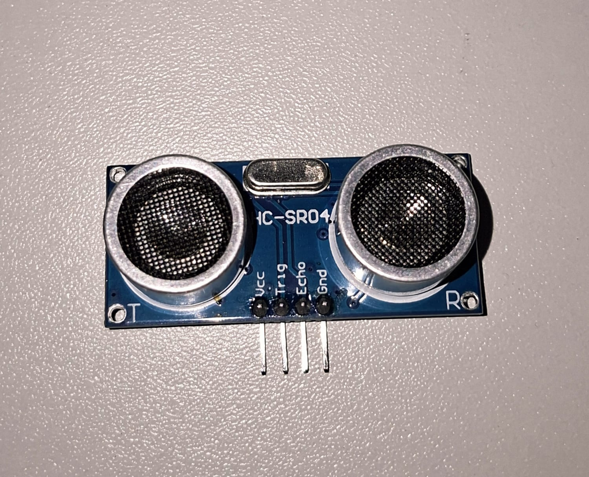
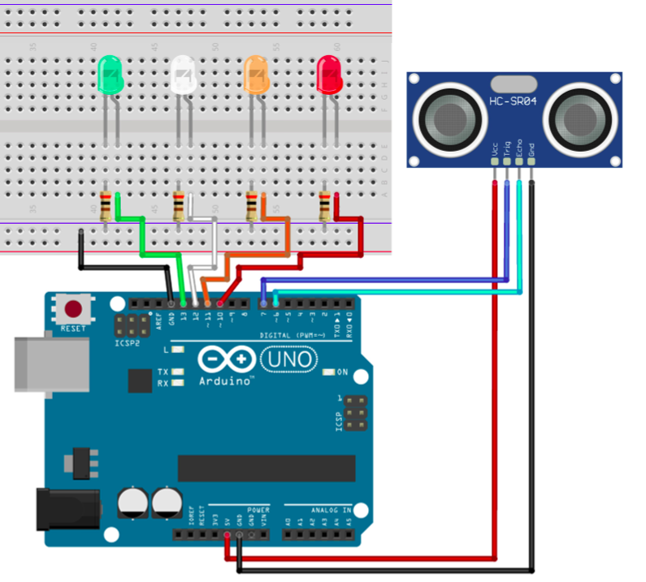

# Sensor Ultrassônico HC-SR04

O HC-SR04 é um sensor ultrassônico utilizado para medir distâncias sem contato físico enviando um pulso ultrassônico através do trigger e o recebendo de volta pelo echo, conseguindo assim o tempo levado pela ida e volta, calculando assim a distância em cm. Neste Circuito, o Arduino realiza a leitura da distância até um objeto e indica sua proximidade através de quatro LEDs coloridos.
Cada LED representa uma faixa de distância, permitindo uma visualização simples e intuitiva da posição do objeto em relação ao sensor.

---

## Componentes Utilizados

| Quantidade | Componente                  |
| ---------- | --------------------------- |
| 1          | Arduino Uno                 |
| 1          | Sensor Ultrassônico HC-SR04 |
| 1          | LED Vermelho                |
| 1          | LED Laranja                 |
| 1          | LED Branco                  |
| 1          | LED Verde                   |
| 4          | Resistores 300 Ω            |
| 4          | Jumpers Fêmea-Macho         |
| 5          | Jumpers Macho-Macho         |
| 1          | Protoboard                  |
| 1          | Cabo USB A/B                |

---

## Componentes

<table>
<tr align="center">

<td>
<b>Arduino Uno</b> 

</td>

<td>
<b>Protoboard</b> 

</td>

<td>
<b>Sensor HC-SR04</b> 

</td>

<td>
<b>LEDs</b> 

</td>

<td>
<b>Resistores 300 Ω</b> 

</td>

<td>
<b>Jumpers Macho-Macho</b> 

</td>
<td>

<b>Jumpers Fêmea-Macho</b> 

</td>

<td>
<b>Cabo USB A/B</b> 

</td>

</tr>
</table>

---

## Ligações

### Sensor HC-SR04

| Sensor | Arduino         |
| ------ | --------------- |
| VCC    | 5V              |
| GND    | GND             |
| TRIG   | Pino Digital 7  |
| ECHO   | Pino Digital 6  |

### LEDs

| LED      | Arduino         |
| -------- | --------------- |
| Verde    | Pino Digital 11 |
| Branco   | Pino Digital 13 |
| Laranja  | Pino Digital 12 |
| Vermelho | Pino Digital 10 |

---

## Esquema do Circuito

---

## Funcionamento

O sensor HC-SR04 envia pulsos ultrassônicos e mede o tempo necessário para que o eco retorne após atingir um objeto. A partir desse tempo, o cógigo calcula a distância em centímetros e aciona os LEDs de acordo com a proximidade do objeto.

A configuração de funcionamento segue:

* LED Verde: objeto distante.
* LED Branco: objeto se aproximando.
* LED Amarelo: objeto próximo.
* LED Vermelho: objeto muito próximo.

---

## Demonstração

[Vídeo de funcionamento](circuito/sensorUltrassonico.mp4)

---

## Código Fonte

[Código-fonte](codigo/codigo.ino)
